###### Automated deployment of high-availability WordPress using EC2, EFS, and Terraform.
 

***Project Overview:***
This project automates the deployment of a highly available, scalable, and low-maintenance WordPress application on AWS. Designed to address the challenges faced by a small marketing agency, the solution eliminates manual setup risks like downtime, data loss, and inefficient scaling.

*Key Components:*

a.) Infrastructure as Code (Terraform):

- Automated provisioning of EC2, EFS, VPC, and Security Groups using reusable Terraform modules.
- Consistent deployments across environments (dev/stage/prod).

b.) Self-Configuring WordPress Server:

- User Data Scripts automate the installation of PHP, WordPress, and EFS utilities on EC2 launch.
- EFS (Elastic File System) ensures persistent storage, allowing multiple instances to share WordPress files.

c.) Scalability & Cost Optimization:

- Decoupled architecture (compute vs. storage) for easy horizontal scaling.
- Optional spot instances for non-production workloads.

***Why This Matters:***

- Faster Deployments: cut infrastructure setup from 4hours to 10mins (96% faster).
- High Availability: EFS prevents data loss during EC2 failures.
- No Vendor Lock-In: Terraform makes it easy to migrate or modify infrastructure.

  ## Prerequisites
  * AWS Account: Admin access to AWS account
  * AWS CLI: Installed and configured with the right credentials
  * Git: [Install git using this link](https://git-scm.com/downloads/win)
  * Terraform: [Install terraform using this link](https://developer.hashicorp.com/terraform/install)
  * Install Visual Studio Code with the neccesary extensions.
 

1) [Link to  GitHub hosting the project files](https://github.com/Tenguh/Terraform-Wordpress-project.git)     


###### Steps used in Deploying WordPress on AWS using Terraform Modules

  2) ***Creating and Cloning your GitHub repository*** 
  * login into your github account, create a new repository **Terraform-Wordpress-project**
  * Open VSC and Create a folder and call it what ever name you wish. say **Terraform_WP_Project**
  * open a new terminal and select **git bash**
  * go to your repo and click on the drop down arrow by code and copy the http link


    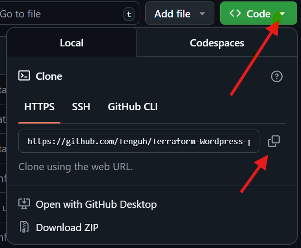
  * Go to your terminal and do a **$ git clone https://github.com/Tenguh/Terraform-Wordpress-project.git**  
  ***replace with your own repo link***
  * This will clone an empty repository.
  
  3) ***Creating VPC, Subnets, IGW, NAT, EIP and Routes using a subnet module.***
  * Choose a provider **AWS**
  * Create a file and call it **provider.tf**. The name of the file can be anything but the extension most be **.tf**
  * For the **provider.tf** file :

  
    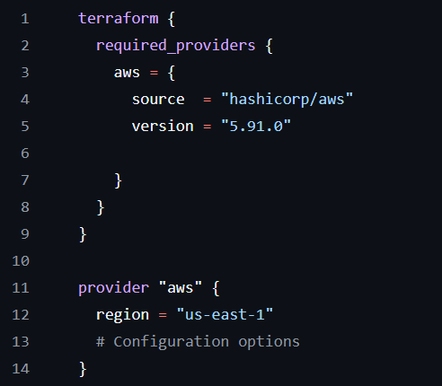

  * For creating the VPC and subnets, create folder and call it **subnet**. under the subnet folder create three different files and name them **subnets.tf**, **outputs.tf** and **variables.tf**


    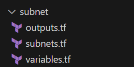

  * Open subnets.tf and include the below code which creates the VPC, the public subnet, private subnets, internet gateway, and routes.


    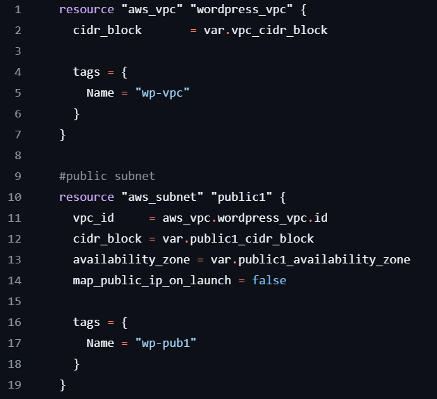,
    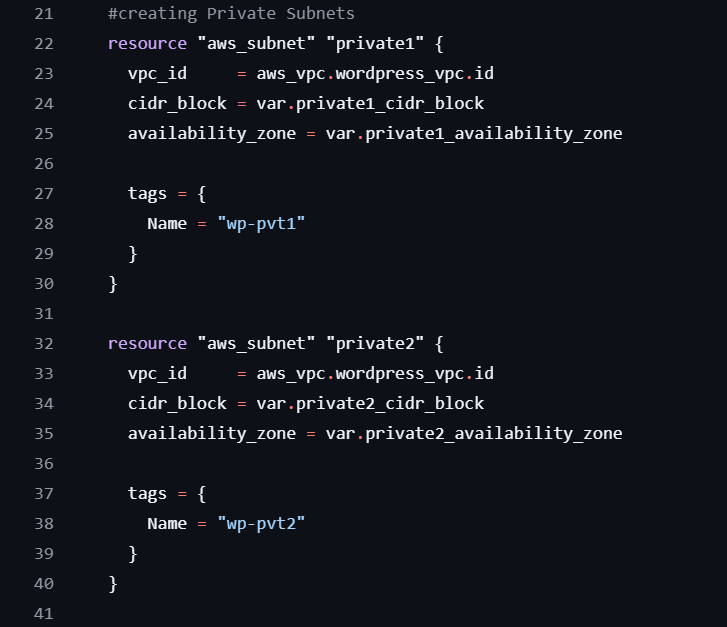,
    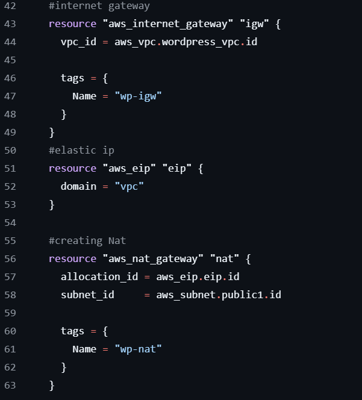,
    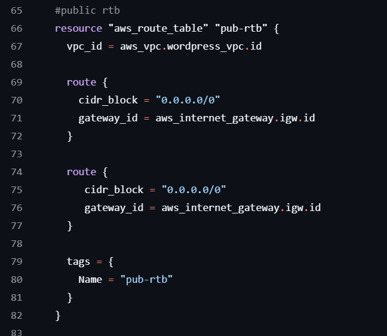,
    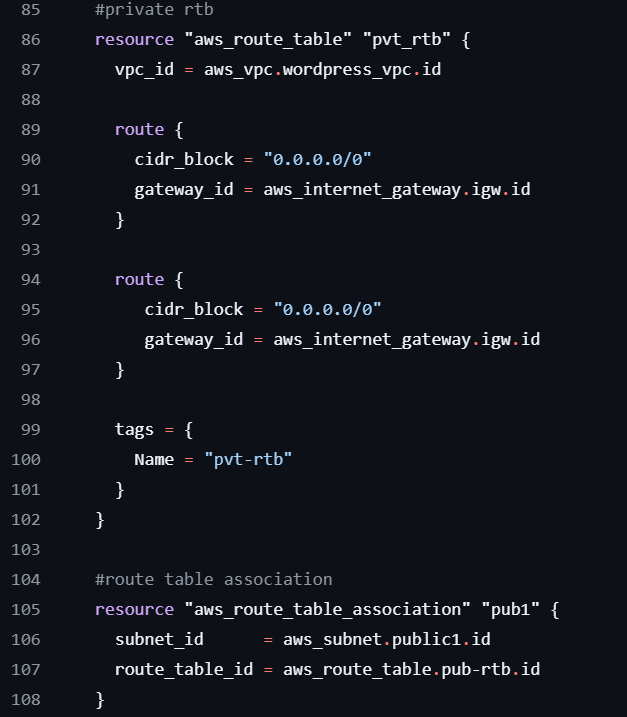,
    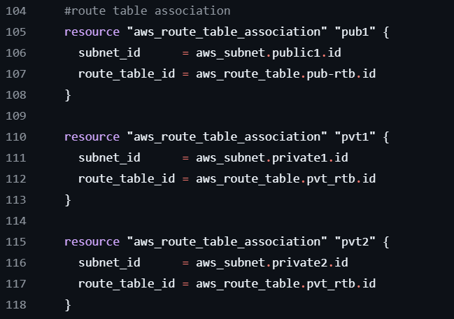

  * Open outputs.tf and create outputs(subnet/outputs.tf)

    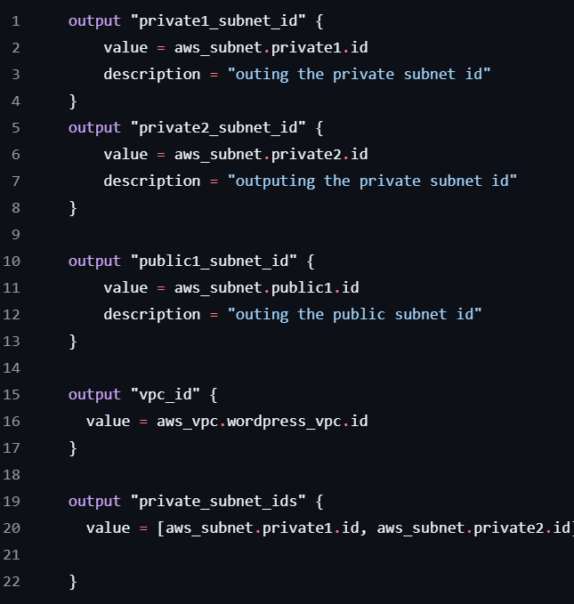 

  * Open variables.tf and create variabes.(subnet/variables.tf)

    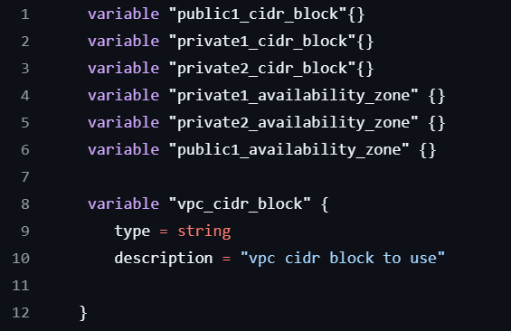
  

  4) ***Creating a keypair, Security group and EC2 Instance using an ec2 module***
  * sign into your AWS account and create a *.pem* key **harriet-key**
  * Go to VSC and create a folder.
  * Call it **EC2**. 
  * under this folder create three different files and name them **ec2.tf**, **outputs.tf** and **variables.tf** 

    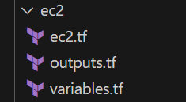

  * Open ec2.tf and create the code for security group and the instance.

   
     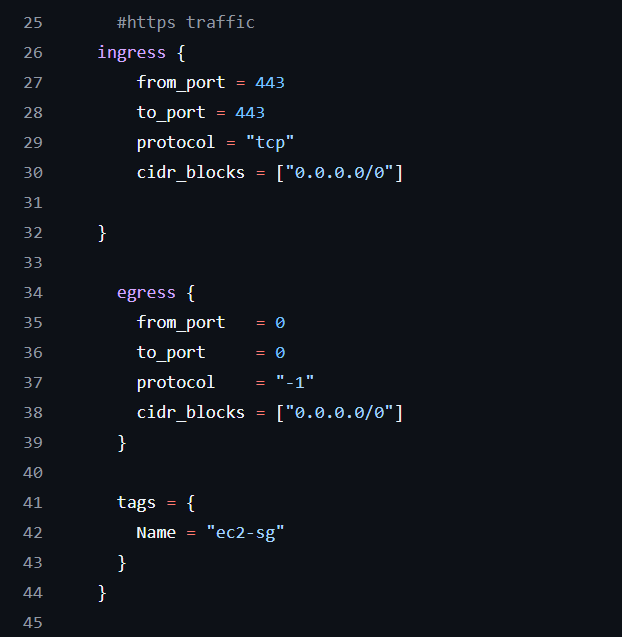,
     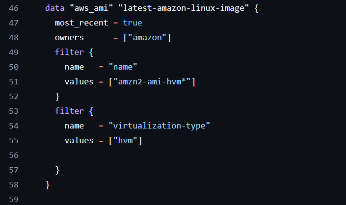,
     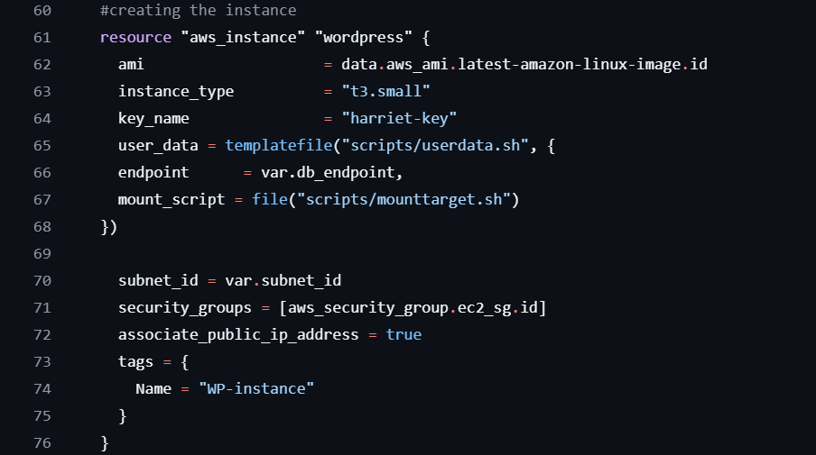
     

  * For ec2/outputs.tf create outputs to be used. 

    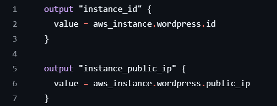

  * Do same for ec2/variables.tf. Create the needed variables.
  
     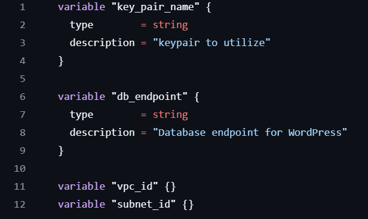
   

  5) ***Setting up RDS Database in a private subnet using a database module***
  * Create a folder and call it **database**. Under this folder create three different files and name them **database.tf, outputs.tf and variables.tf** 


      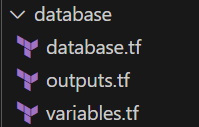

  * Open database.tf and create the configuration code for database security group, database instance and database subnet group. 

      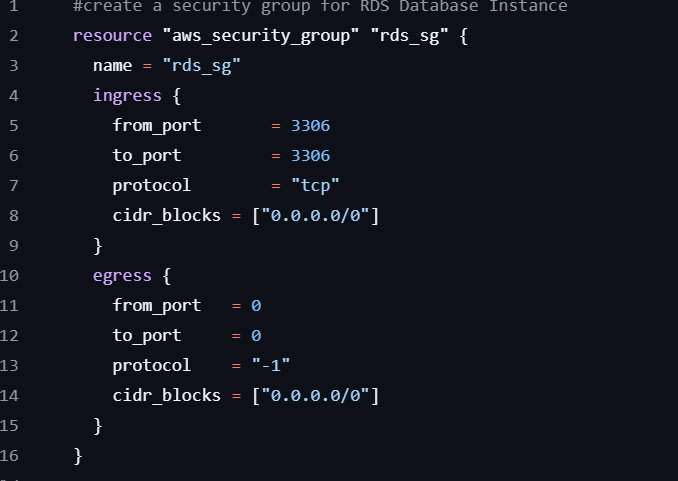,
      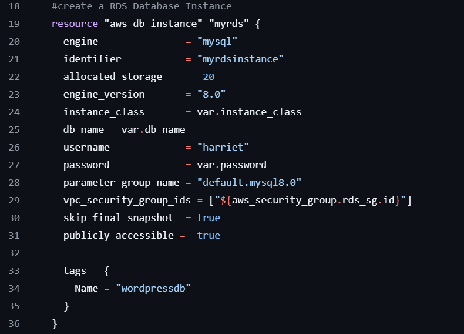,
      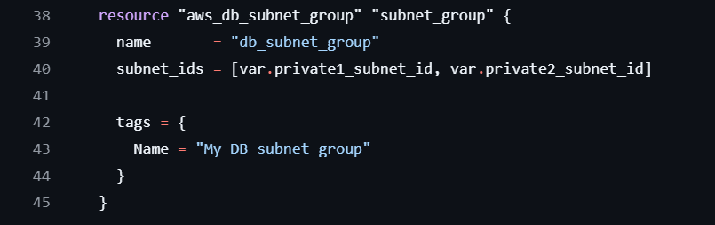

  * Open database/outputs.tf and create outputs needed. 
      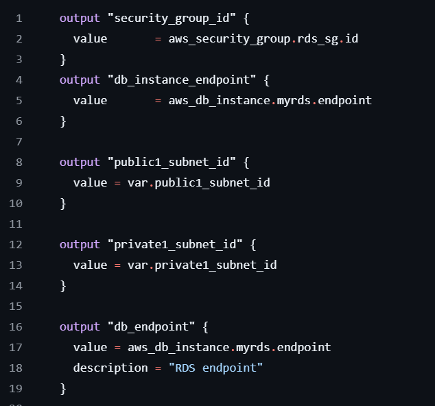

  * Open database/variables.tf and do same

      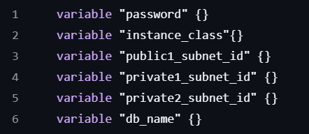


  6) ***Setting up the Elastic File System (EFS), mount target and security group for EFS***
  - Create folder and call it **efs**. under this folder create three different files and name them **efs.tf, outputs.tf and variables.tf**

       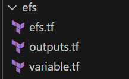

  - Open efs.tf and write code which creates efs security group, elastic file system and the mount target.

        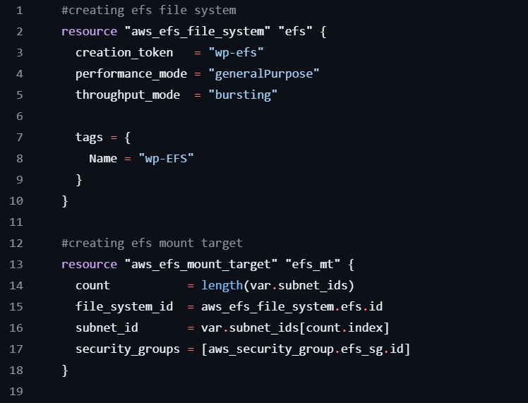,
        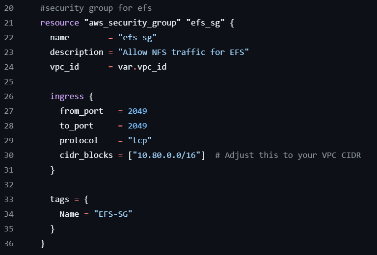

  - Open efs/variables.tf and create variables to be used.

      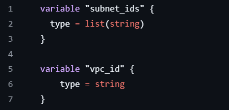
  

  7) ***Installation and configuration of WordPress and EFS utilities on the EC2 instance.***
  * Create a folder and call it **scripts**. 
  * Under this folder create two different files and name them **userdata.sh** and **mounttarget.sh**
  * Open userdata.sh and paste the script that installs WordPress on the instance.
  ## User data 
   Copy the userdata below and paste in the userdata.sh
 
```bash
#!/bin/bash
set -ex  # Enable debugging and stop on errors

# 1️⃣ Update System and Install Required Repositories
sudo yum update -y
sudo amazon-linux-extras enable php7.4  # Enable PHP 7.4
sudo yum install -y httpd php php-cli php-mysqlnd php-mbstring php-xml mariadb105

# 2️⃣ Start and Enable Apache Web Server
sudo systemctl start httpd
sudo systemctl enable httpd

# 3️⃣ Change Apache Permissions to Allow EC2 User
sudo usermod -a -G apache ec2-user
sudo chown -R ec2-user:apache /var/www
sudo chmod -R 775 /var/www

# 4️⃣ Download and Configure WordPress
cd /var/www/html
wget https://wordpress.org/latest.tar.gz
tar -xzf latest.tar.gz
mv wordpress/* .  # Move files to root web directory
rm -rf wordpress latest.tar.gz
chown -R apache:apache /var/www/html

# 5️⃣ Create WordPress Config File
cp wp-config-sample.php wp-config.php

# 6️⃣ Configure WordPress Database (Replace with Your DB Details)
sed -i "s/database_name_here/wordpress/" wp-config.php
sed -i "s/username_here/harriet/" wp-config.php
sed -i "s/password_here/mydbpassword/" wp-config.php
sed -i "s/localhost/${endpoint}/" wp-config.php

# 7️⃣ Restart Apache
sudo systemctl restart httpd

```


Now open mounttarget.sh and paste the script that installs EFS utilities and automatically mounts the EFS storage on the instance.

```bash
# script to install EFS utilities and automatically mounts the EFS storage at /mnt/efs.
 #!/bin/bash
    sudo yum install -y amazon-efs-utils
    mkdir -p /mnt/efs
    mount -t efs ${aws_efs_file_system.efs.id}:/ /mnt/efs

```

8) ***Creating the main.tf, terraform.tfvars and the variable files***
  * Create a file and call it variables.tf
  * Create these variables in it 

    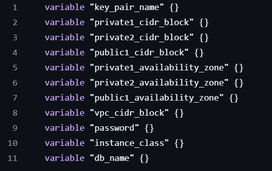

  * Create another file and call it terraform.tfvars
  * Open and create the values for each variable in the variables.tf file we just created.
  * Create a file and call it **main.tf**.
  * Open this file and create the following Modules; 

    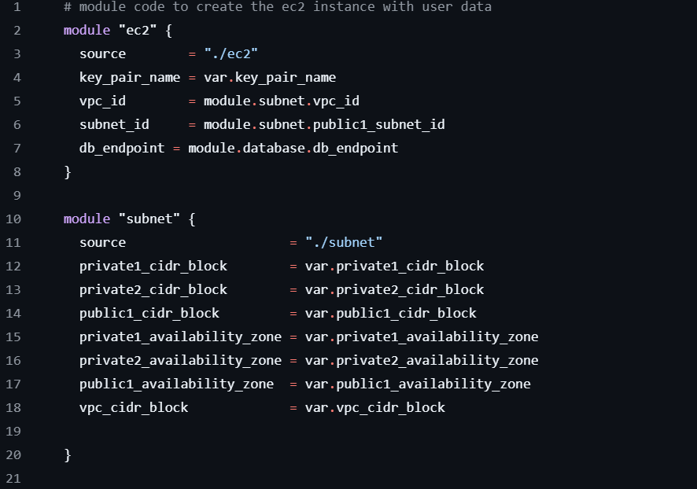,
    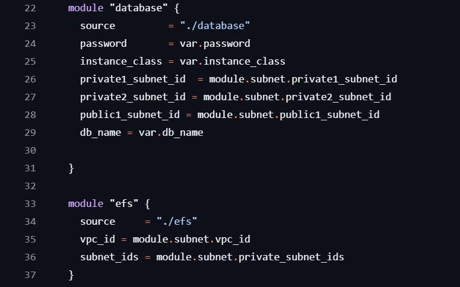


Move to the terraform directory where all the files are located 

    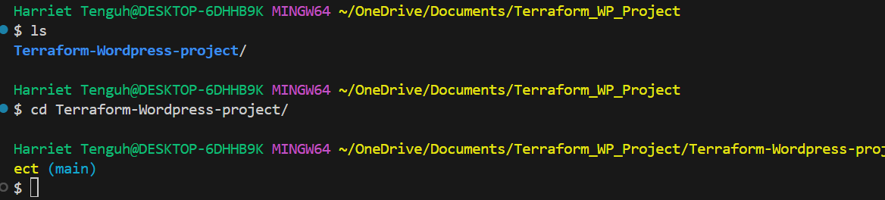 

and install the required plugins that will be used in creating your infrastructure on AWS by running the command ***$ terraform init***

  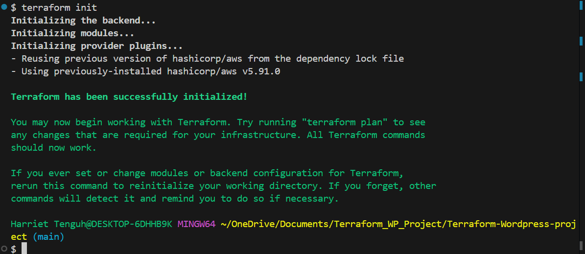

* Now run ***$ terraform plan*** which shows the changes that will be made to your infrastructure.

    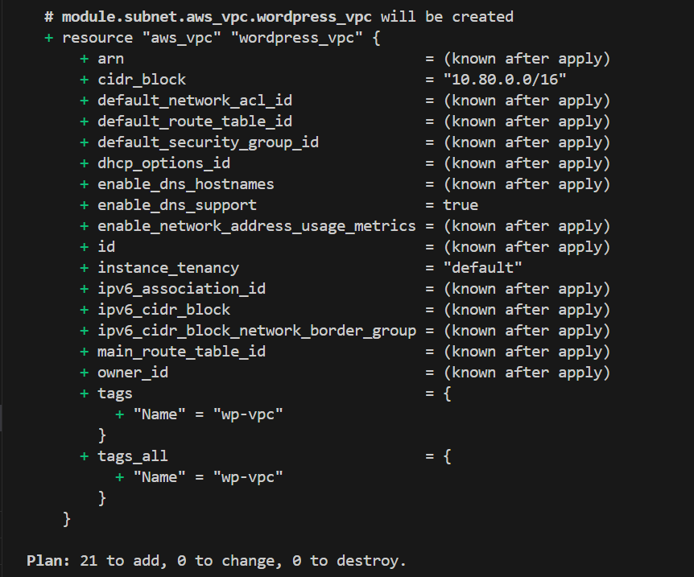

* With a successfully terraform plan, we are sure our infrastucture is ok so we can now run ***terraform apply -auto-approve*** to create the infrastructure in AWS.

***Note***:
It is best practice to run 
***$ terraform apply*** 
and get a prompt to either say *yes*  for the infrastructure to be created or *no* not to create the infrastructure after reviewing.

   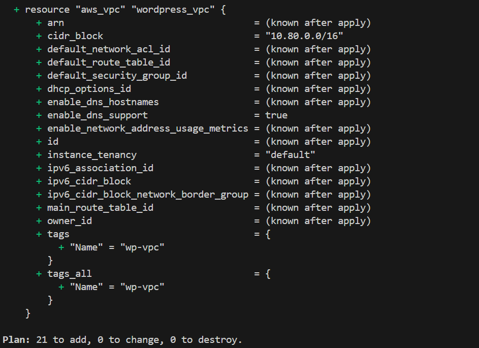
   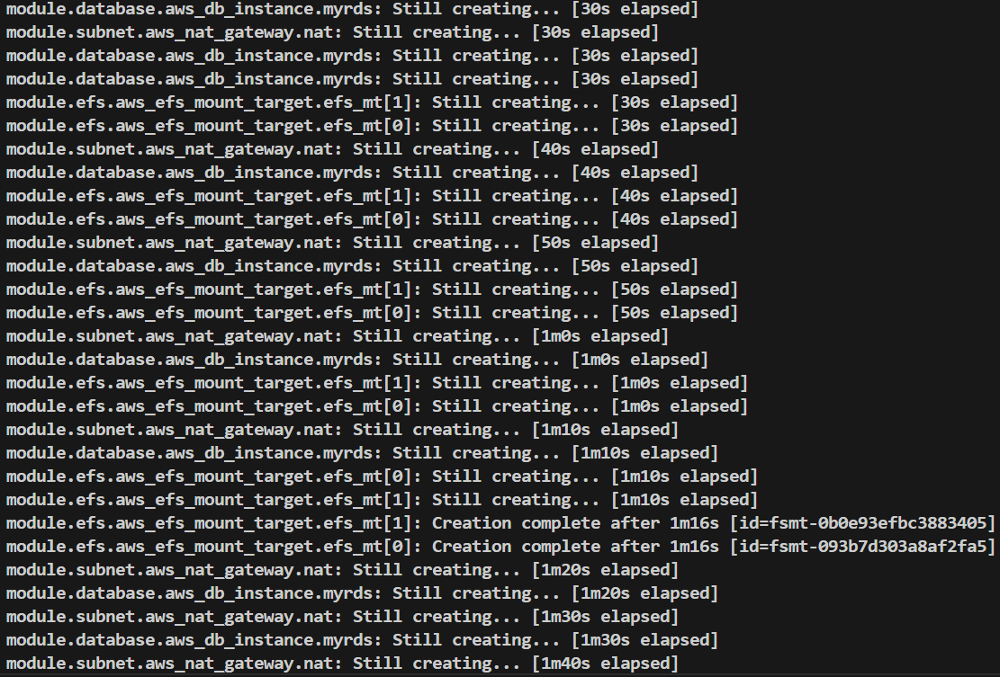
   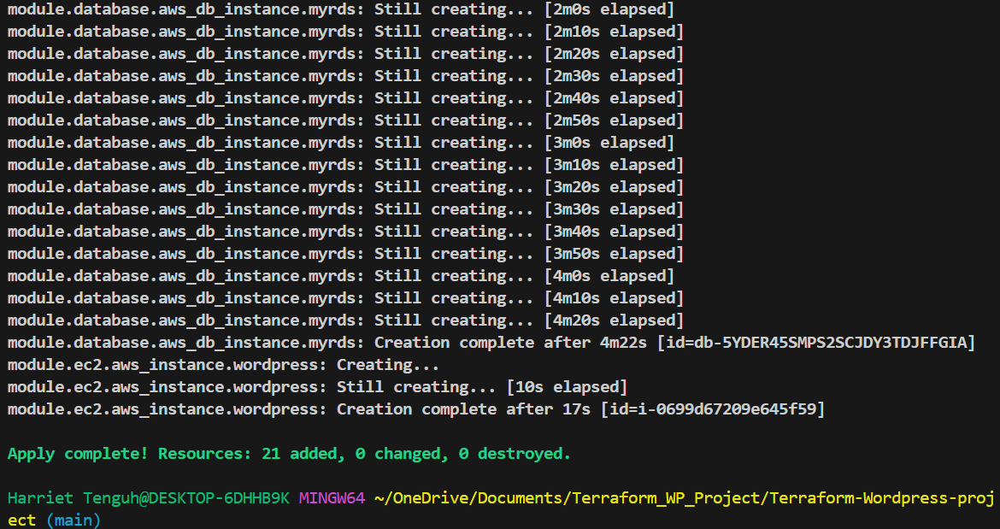

###### Open your AWS account and see all the resources created.
  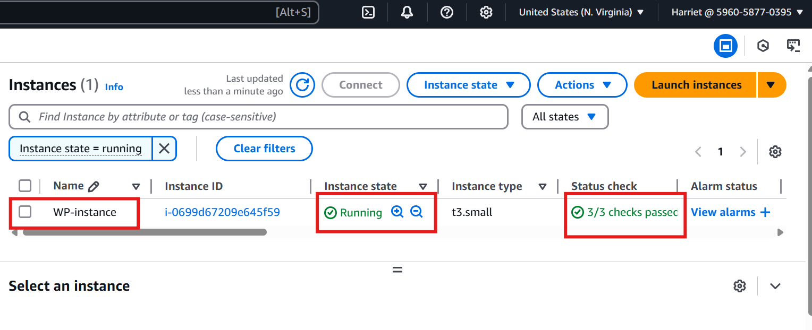
  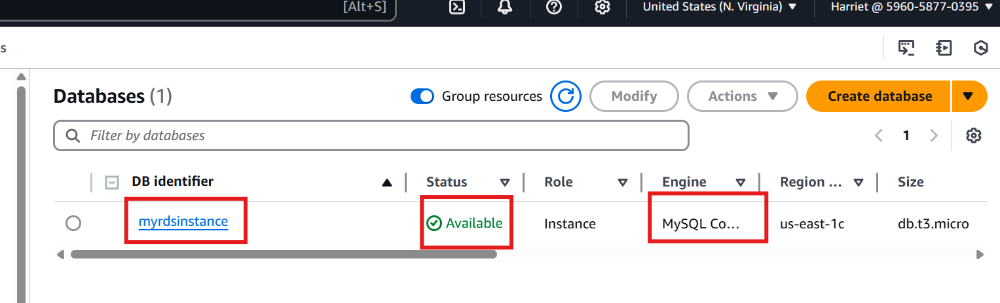
  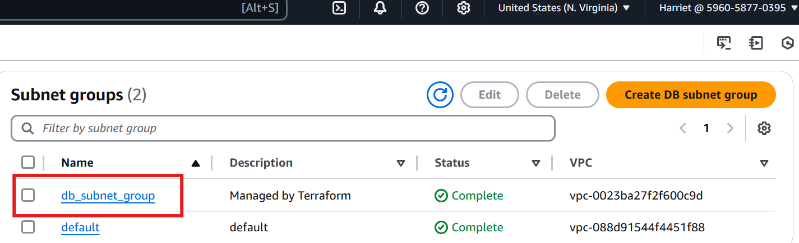
  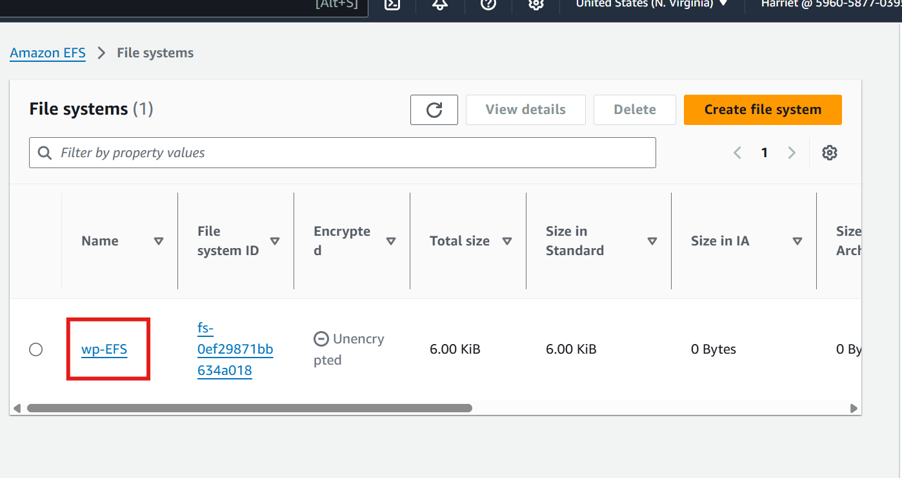


9) ***pushing your code to github and Login into your Database***
 - Finally push changes to repo
        
        $ git add .
        $ git commit -m "relevant commit message"
        $ git push
        

- Go to the console, open ec2 - instances
  * copy the public ip of the WordPress Instance
    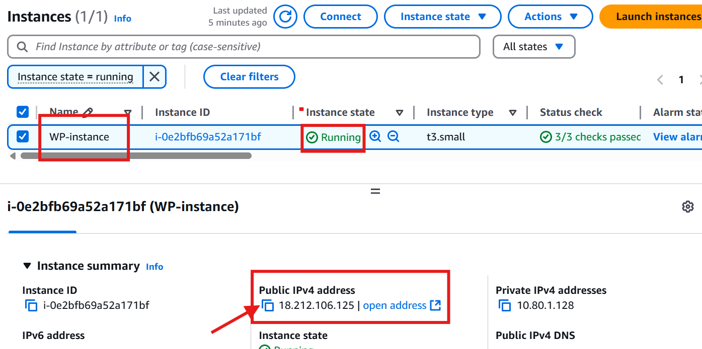

  * Paste the public ip in a new browser and press enter
    ![installation]](./ReadmeImages/-1.png)

  * A page opens, select your language
  * Scroll right down and click continue

    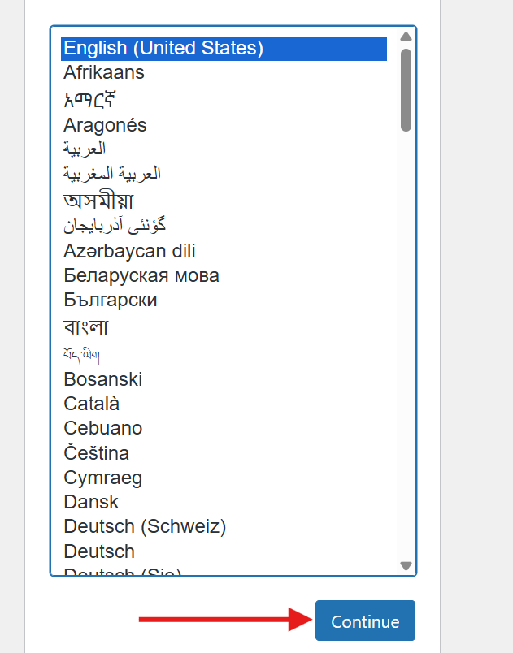

  * The ***WordPress installation Page*** opens
  * Fill in the information needed
  * Tick the comfirm password box if your password is weak
  * Click on install wordpress

    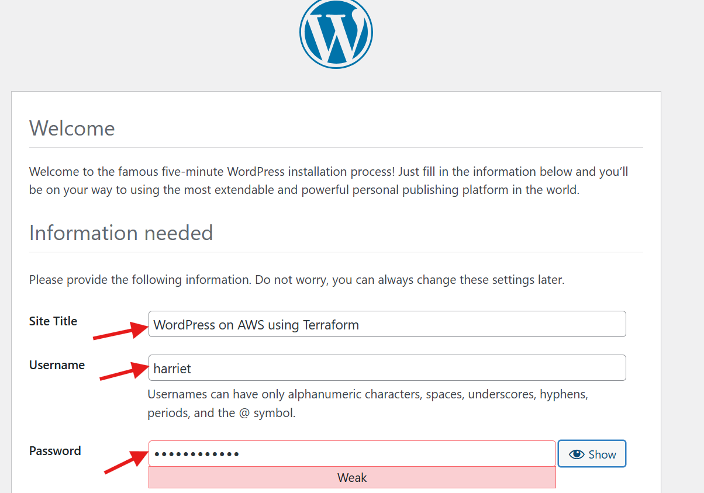
    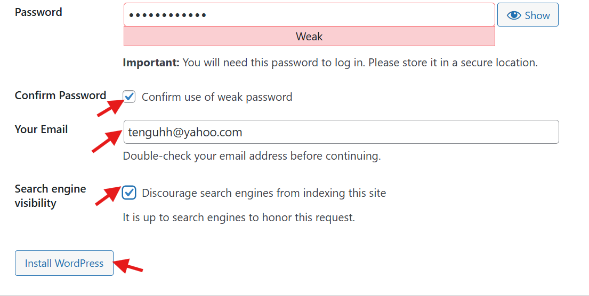

  * A page opens showing successful installation
  * Click on login

    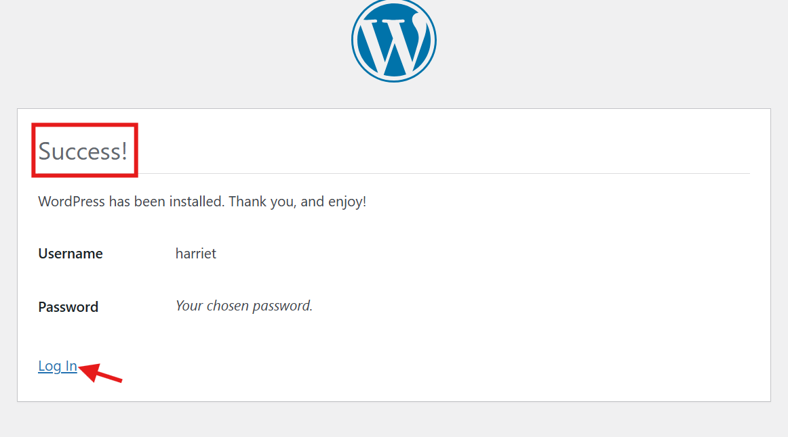

  * Input the username or email and password you used above in installing wordpress
  * Click on Login

    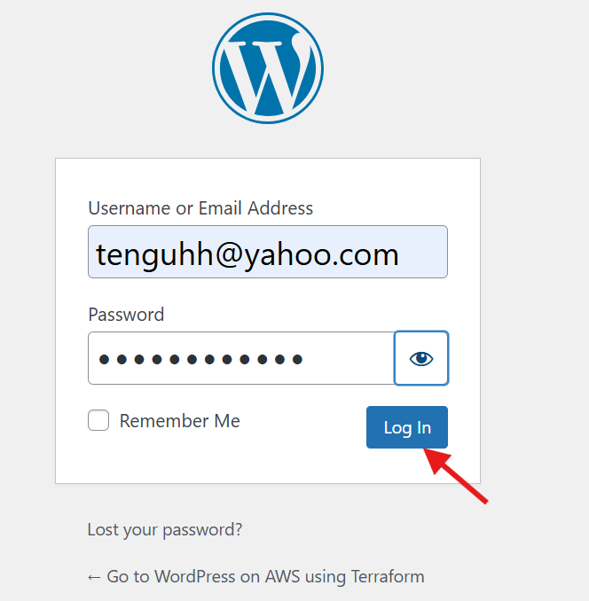

  * This takes you to the welcome page(dashboard) of WordPress

    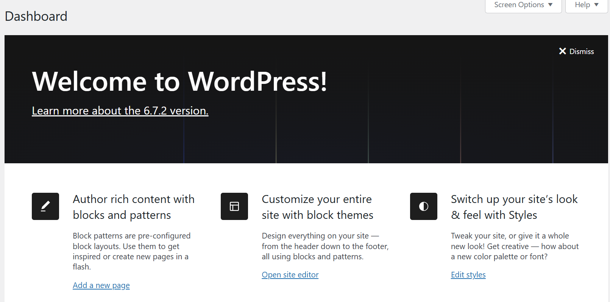

        
 Finally,play around with it and do some modifications as you like .
  * you can add another user by clicking on user
  select all users.      

  ###### Destroy the infrastructure
* Go to your terminal and run 

***$ terraform destroy -auto-approve***

## 😊 Well Done everyone 😊


# Conclusion & Key Takeaways
* Terraform simplifies and automates WordPress deployment on AWS
* AWS services ensure scalability, security, and automation
* The architecture balances public access with private security


