# "Deploying WordPress on AWS with Terraform"

  - In this project, i will deploy a wordpress application on AWS EC2, with relational database (RDS) , ensuring rebust security with security groups while using Terraform to automate on AWS.

*Repository Link:*  **https://github.com/Tenguh/Terraform-Wordpress-project.git**
# Detailed Architecture Flow

# Diagram Explanation:
 - Users access WordPress via EC2 in the public subnet
 - EC2 connects to RDS (MySQL) for the database
 - EFS used for scalable storage (themes, plugins, media)
 - NAT Gateway enables EC2 instances in private subnets to download updates
 - Security Groups ensure secure access.

# Why Terraform
- Automates AWS resource provisioning.
- Ensures infrastructure consistency.
- Easy to scale and modify.

# The AWS Services Used and WHY
1. **EC2**
 - Host the WordPress application and databases
 - Scalable compute power
 - Flexible instance types

 2. **VPC, Subnets,& Security Groups**
 - Isolated network for security
 - Public & private subnets for controlled access

 3. **RDS**
 - stores and manages the Wordpress Database
 - Managed database with automated backups
 - Highly available and scalable 

4. **EFS**
 - Automatically scales based on demand
 - Cost effective as you only pay for the storage you use and not the storage you provisioned
 - Persist Data. If the instance is stopped or terminated, data will not be lost.
 - AWS manages the underlying infrastructure for me,hence management is simplified.
 - Incase you decide to use multiple EC2 instances, EFS will also enable the multiple instances to access thesame file easing availability

5. **Internet Gateway & NAT Gateway**
 - Internet Gateway: Allows public access to the EC2 instance
 - NAT Gateway: Allows private resources to fetch updates securely

## Steps used in Deploying WordPress on AWS using Terraform

  **Step 1: Creating and Cloning your GitHub repository** 
  - login into your github account, create a new repository **https://github.com/Tenguh/Terraform-Wordpress-project.git**
  - Open VSC and Create a folder and call it what ever name you wish. say **Terraform_WP_Project**
  - open a new terminal and select **git bash**
  - go to your repo and click on the drop down arrow by code and copy the http link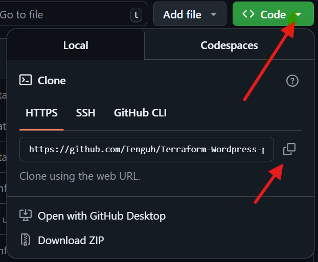
  - Go to your terminal and do a **git clone https://github.com/Tenguh/Terraform-Wordpress-project.git** *replace with your own repo link*
  - this will clone an empty repository.

  **Step 2: Creating VPC, Subnets, IGW, NAT, EIP and Routes using a subnet module .**
  - Choose a provider **AWS**
  - Create a file and call it **provider.tf**. The name of the file can be anything but the extension most be **.tf**
  - Copy and past below code into **provider.tf** 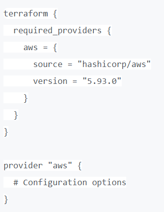
  - For creating the VPC and subnets, create folder and call it **subnet**. under the subnet folder create three different files and name them **subnets.tf, outputs.tf and variables.tf**
  - Open subnets.tf and paste the below code which creates the VPC, the public subnet, private subnets, internet gateway, and routes.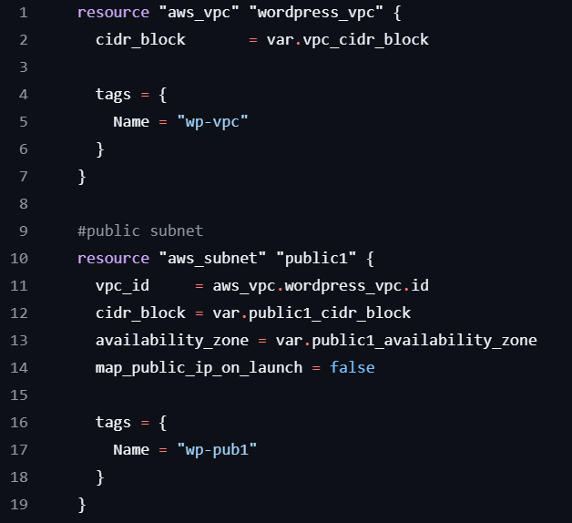,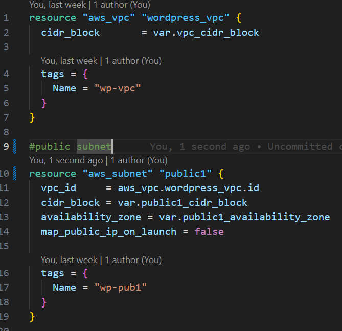, 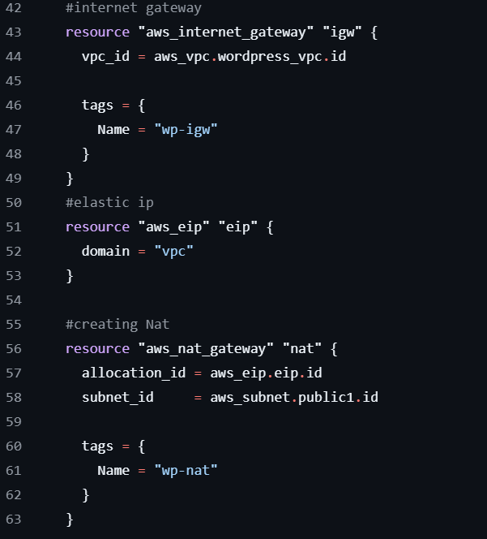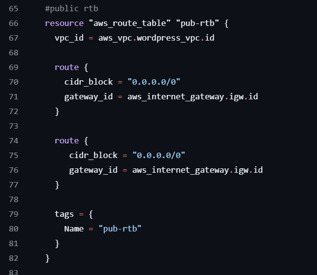, 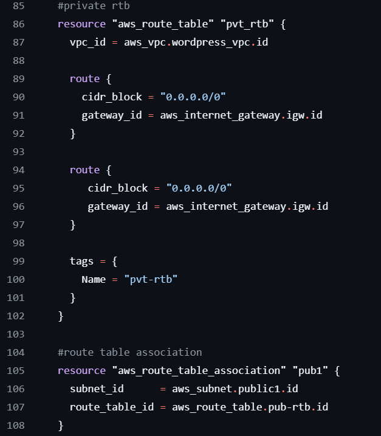,
  - Open outputs.tf and paste this code.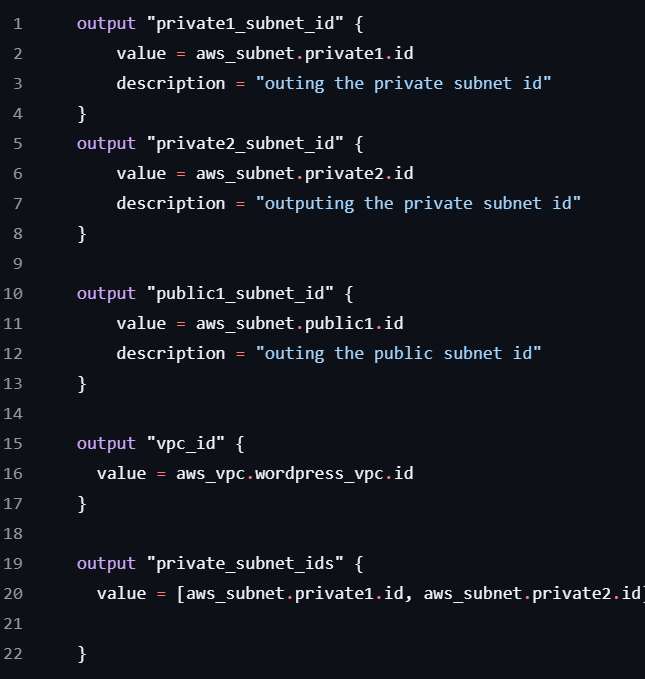 
  - Open variables.tf and paste this code.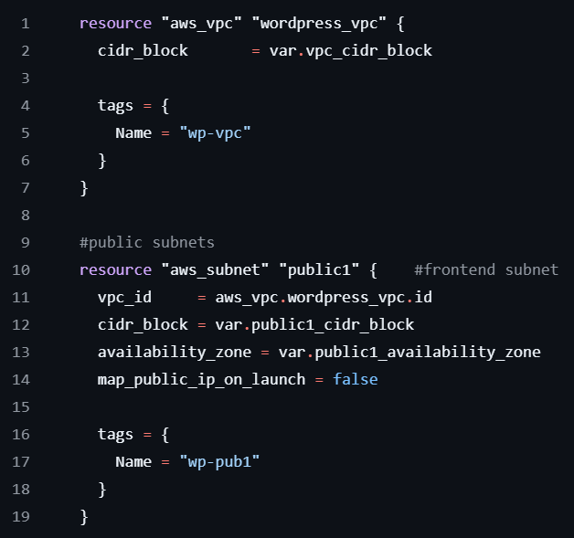
  

  **Step 3: Creating Security group and EC2 Instance**
  - Create folder and call it **EC2**. under this folder create three different files and name them **ec2.tf, outputs.tf and variables.tf**
  - Open ec2.tf and paste the below code which creates security groups and the instance.
   hich is paramount when hosting a website. AWS Security group provide essential firewall protection ensuring your WordPress site stays secured.

  **Step 3:**
  - Set up RDS Database in a private subnet.
 # - Set up EFS to store configuration files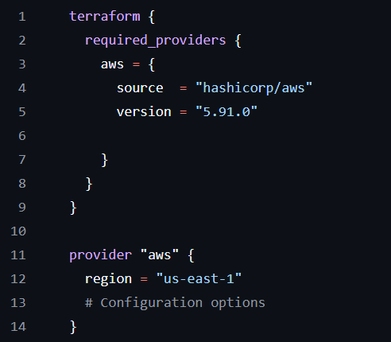, plugins and website content and mounttarget 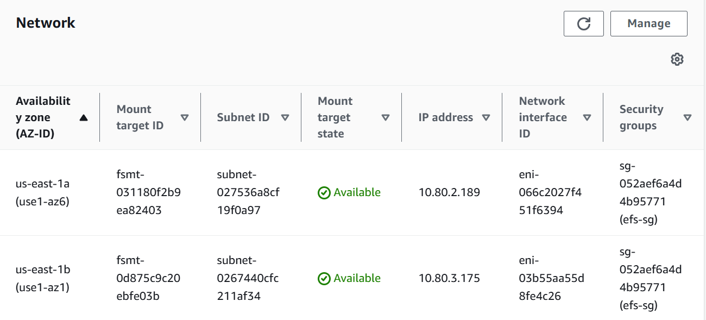
  - configure security groups on EC2(), RDS Instance and EFS to allow traffic only between them based on the ports.

  **Step 4:**
  - Install and configure WordPress on the EC2 instance using userdata script that contains the wordpress config.php to establish a connection to the RDS MySQL Instance and also connect the EC2 Instance and the RDS Instance.
  - Use script to install EFS utilities and automatically mounts the EFS storage on the instance.

  **Step 5(optional):**
  - Set up IAM Role to grant the instance permission to access the RDS Instance
  - Set up S3 to store static assets reducing load on the EC2 instance 
  - Use S3 and DynamoDB in storing and locking the statefile respectively.

## Challenges & Solutions
# Challenges: 
 - Managing Terraform state
 - Security concerns
 - Scalibility concerns

# Solution: 
 - used S3 + DynamoDB for state management
 - Proper IAM roles, security groups, and encryption
 - Used EfS to ensure scalibility 

# Conclusion & Key Takeaways
Terraform simplifies WordPress deployment on AWS

AWS services ensure scalability, security, and automation

The architecture balances public access with private security

call this function: templatefile(userdata.sh, {endpoint: var.db_endpoint })
instead of: file(userdata.sh)

update: userdata.sh
sed .. /localhost/${endpoint}/ 

