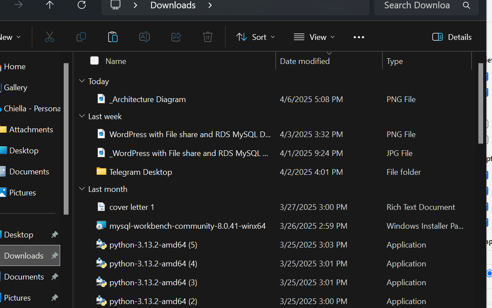
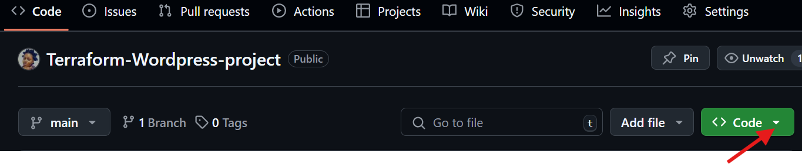

# Terraform-Wordpress-project
### In this project, i will deploy a wordpress application on AWS EC2 with RDSusing Terraform to automate on AWS.
## in this project, i will perform the following task
# use Terraform in deploying a script in a virtual machine in the public subnet, while the RDS is deployed in the private subnet.

