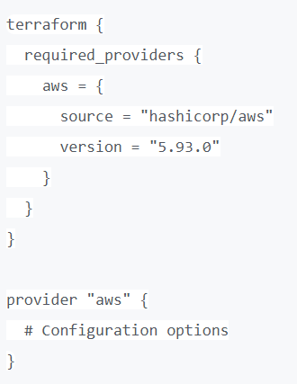

# Deploying WordPress on AWS with RDS using Terraform Modules


## Overview
 In this project, I will automate the deployment of WordPress application on AWS. The project will guide you through setting up a WordPress server on EC2 instance. I equally leverage on terraform modules to create the various AWS services. WordPress is installed on the ec2 instance with the help of userdata script that Install PHP and WordPress. Also EFS utilities are installed and configured on the ec2 instance using a userdata script. The following AWS services were used alongside terraform as our Infrastructure as code tool 
  * EC2 to host the WordPress application and Database.
  * VPC, Subnets,& Security Groups: to create an isolated network for security and controlled access.
  * RDS for storing and managing the Wordpress Database.
  * EFS Automatically scales based on demand, cost effective, helps persist data and management is simplified.
  * Internet Gateway allows public access to the EC2 instance.
  * NAT Gateway allows private resources to fetch updates securely.
  
  

## Prerequisites
    * AWS Account:  Admin access to AWS account
    * AWS CLI: installed and configured with the right credentials
    * Git: install git using this link
    * Terraform: Install terraform using this link
    * Install Visual Studio Code with the neccesary extensions.
 

1) [Link to  GitHub hosting the project files](https://github.com/Tenguh/Terraform-Wordpress-project.git)     


###### Steps used in Deploying WordPress on AWS using Terraform Modules

  **Step 1: Creating and Cloning your GitHub repository** 
  - login into your github account, create a new repository **https://github.com/Tenguh/Terraform-Wordpress-project.git**
  - Open VSC and Create a folder and call it what ever name you wish. say **Terraform_WP_Project**
  - open a new terminal and select **git bash**
  - go to your repo and click on the drop down arrow by code and copy the http link
  - Go to your terminal and do a **git clone https://github.com/Tenguh/Terraform-Wordpress-project.git** *replace with your own repo link*
  - this will clone an empty repository.

  **Step 2: Creating VPC, Subnets, IGW, NAT, EIP and Routes using a subnet module .**
  - Choose a provider **AWS**
  - Create a file and call it **provider.tf**. The name of the file can be anything but the extension most be **.tf**
  - Copy and past below code into **provider.tf** 
  - For creating the VPC and subnets, create folder and call it **subnet**. under the subnet folder create three different files and name them **subnets.tf, outputs.tf and variables.tf** 
  - Open subnets.tf and paste the below code which creates the VPC, the public subnet, private subnets, internet gateway, and routes.,, , ,
  - Open outputs.tf and paste this code. 
  - Open variables.tf and paste this code.
  

  **Step 3: Creating a keypair, Security group and EC2 Instance using an ec2 module**
  - sign into your AWS account and create a *.pem* key **harriet-key**
  - Create folder and call it **EC2**. under this folder create three different files and name them **ec2.tf, outputs.tf and variables.tf** 
  - Open ec2.tf and paste the below code which creates security groups and the instance., ,, 
  - Open ec2/outputs.tf and paste this code. 
  - Open ec2/variables.tf and paste this code.
   

  ***Step 4:Setting up RDS Database in a private subnet using a database module***
  - Create folder and call it **database**. under this folder create three different files and name them **database.tf, outputs.tf and variables.tf** 
  - Open database.tf and paste the below code which creates database security group, database instance and database subnet group. , , 
  - Open database/outputs.tf and paste this code. 
  - Open database/variables.tf and paste this code. 


  ***Step 5: Setting up the Elastic File System (EFS), mount target and security group for EFS***
  - Create folder and call it **efs**. under this folder create three different files and name them **efs.tf, outputs.tf and variables.tf**
  - Open efs.tf and paste the below code which creates efs security group, elastic file system and the mount target., 
  - Open efs/variables.tf and paste this code 
  

  ***Step 6:Installation and configuration of WordPress and EFS utilities on the EC2 instance.***
  * Create a folder and call it **scripts**. 
  * Under this folder create two different files and name them **userdata.sh** and **mounttarget.sh**
  * Open userdata.sh and paste the script that installs WordPress on the instance.
  ## User data 
 Copy the userdata below and paste in the userdata.sh
 
```bash
#!/bin/bash
set -ex  # Enable debugging and stop on errors

# 1️⃣ Update System and Install Required Repositories
sudo yum update -y
sudo amazon-linux-extras enable php7.4  # Enable PHP 7.4
sudo yum install -y httpd php php-cli php-mysqlnd php-mbstring php-xml mariadb105

# 2️⃣ Start and Enable Apache Web Server
sudo systemctl start httpd
sudo systemctl enable httpd

# 3️⃣ Change Apache Permissions to Allow EC2 User
sudo usermod -a -G apache ec2-user
sudo chown -R ec2-user:apache /var/www
sudo chmod -R 775 /var/www

# 4️⃣ Download and Configure WordPress
cd /var/www/html
wget https://wordpress.org/latest.tar.gz
tar -xzf latest.tar.gz
mv wordpress/* .  # Move files to root web directory
rm -rf wordpress latest.tar.gz
chown -R apache:apache /var/www/html

# 5️⃣ Create WordPress Config File
cp wp-config-sample.php wp-config.php

# 6️⃣ Configure WordPress Database (Replace with Your DB Details)
sed -i "s/database_name_here/wordpress/" wp-config.php
sed -i "s/username_here/harriet/" wp-config.php
sed -i "s/password_here/mydbpassword/" wp-config.php
sed -i "s/localhost/${endpoint}/" wp-config.php

# 7️⃣ Restart Apache
sudo systemctl restart httpd

* Open mounttarget.sh and paste the script that installs EFS utilities and automatically mounts the EFS storage on the instance.
```bash
# script to install EFS utilities and automatically mounts the EFS storage at /mnt/efs.
 #!/bin/bash
    sudo yum install -y amazon-efs-utils
    mkdir -p /mnt/efs
    mount -t efs ${aws_efs_file_system.efs.id}:/ /mnt/efs

  # Step 7:Creating the main.tf, terraform.tfvars and the variable files
  - Create a file and call it variables.tf
  - Paste these variables in it 
  - Create another file and call it terraform.tfvars
  - *Open and create the values for each variable in the variables.tf file we just created.*
  - Create a file and call it **main.tf**.
  - Open this file and paste the following Modules; , 

Move to the terraform directory where all the files are located  and 
Install the required plugins that will be used in creating your infrastructure on AWS by running the command **terraform init**


* Now run **terraform plan** which shows the changes that will be made to your infrastructure.


* with a successfully terraform, we are sure our infrastucture is ok so we can now run *terraform apply -auto-approve* to create the infrastructure in AWS.

Open your AWS account and see all the resources created.


!


## Challenges & Solutions
# Challenges: 
 - Managing Terraform state
 - Security concerns
 - Scalibility concerns

# Solution: 
 - used S3 + DynamoDB for state management
 - Set proper security groups and encryption
 - Used EfS to ensure scalibility 

# Conclusion & Key Takeaways
Terraform simplifies WordPress deployment on AWS
AWS services ensure scalability, security, and automation
The architecture balances public access with private security


